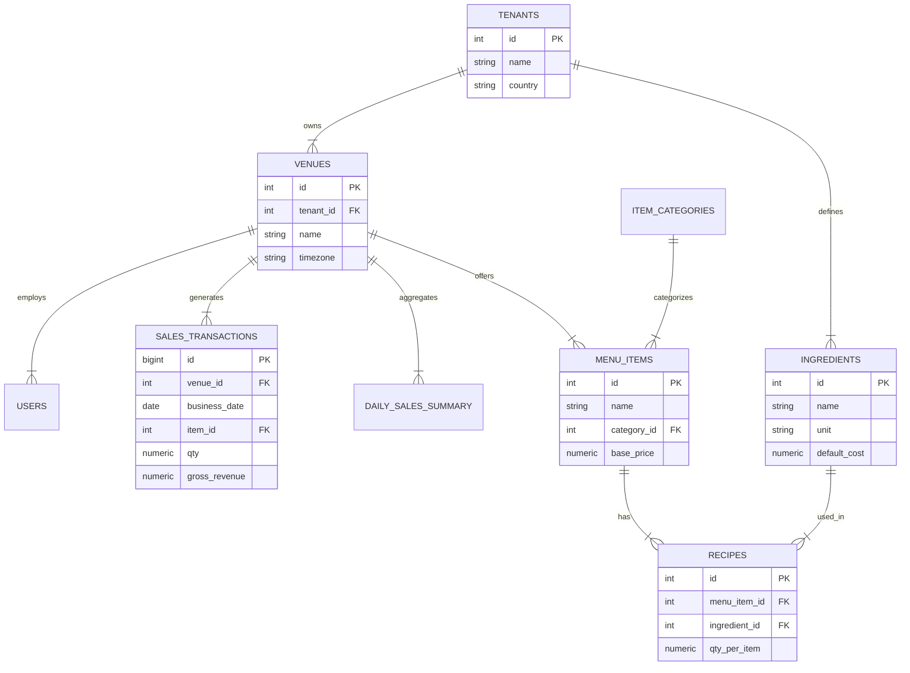

# ⭐ Flux: Technical and Modeling Deep Dive

**A fully end-to-end architecture and system design overview**

Flux is a modular, event-driven analytics platform designed for small restaurants with inconsistent and sparse data. The system combines:
*   **ETL & data modeling**
*   **Probabilistic forecasting**
*   **Optimization engines** (inventory, staffing)
*   **Risk-adjusted decision metrics** (FluxSharpe)
*   **Web dashboard + API layer**

Everything is built around simple, explainable, low-data-tolerant models with the ability to scale up if richer data becomes available.

---

## 🧱 1. Tech Stack (Full Breakdown)

### Backend / Analytics
*   **Python 3.12+**
*   **Pandas / Polars**: Data wrangling
*   **NumPy / SciPy**: Statistical modeling
*   **statsmodels**: SARIMA & GLM
*   **Prophet / NeuralProphet**: Optional fallback models
*   **PyMC**: Bayesian hierarchical modeling
*   **OR-Tools / PuLP**: Optimization (inventory, staffing)
*   **Redis**: Caching forecasts, storing recent computed results, background job queues

### API Layer
*   **FastAPI**: Async endpoints
*   **OpenAPI schemas**
*   **JWT auth**: Multi-tenant design

### Frontend
*   **v1 MVP**: Streamlit (fastest, easiest, secure via auth)
*   **Scale**: React + Next.js

### Database
*   **PostgreSQL 15+**
    *   Tables: `restaurants`, `sales_transactions`, `menu_items`, `ingredients`, `recipes`, `inventory_levels`, `deliveries`, `staffing_logs`, `weather_history`, `forecast_results`

### Infrastructure
*   **Docker + Docker Compose**
*   **Optional AWS**: ECS Fargate, RDS Postgres, S3, CloudWatch
*   **Low-cost**: Fly.io / Railway.app

### Compute Model
*   **Forecasts computed**: Nightly batch jobs or on-demand triggered by data upload
*   **Storage**: Postgres + Redis cache for fast dashboard load

---

## 🏛️ 2. System Architecture

### Top-Level Architecture

```mermaid
flowchart TD

%% FRONTEND
A1[Restaurant Owner\nDashboard UI<br>(Streamlit / React)] -->|HTTPS| B1

%% API LAYER
B1[FastAPI Backend<br>/api/*] --> B2[Auth & Permissions]
B1 --> B3[Forecasting Router]
B1 --> B4[Inventory Router]
B1 --> B5[Staffing Router]
B1 --> B6[Upload Router]

%% SERVICES
B3 --> C1[Forecasting Service]
B4 --> C2[Inventory Service]
B5 --> C3[Staffing Service]
B6 --> C4[ETL / Ingestion Service]

%% DATA SOURCES
C4 --> D1[(Postgres\nsales_transactions)]
C4 --> D2[(Postgres\nmenu_items)]
C4 --> D3[(Postgres\ningredients)]
C4 --> D4[(Postgres\nrecipes)]
C4 --> D5[(Postgres\ndaily_sales_summary)]
C4 --> D6[(Postgres\nweather_data)]
C4 --> D7[(Postgres\nevent_calendar)]

%% ANALYTICS ENGINE
C1 --> E1[SARIMA Model]
C1 --> E2[Bayesian Hierarchical Model]
C1 --> E3[Prophet / ETS Fallback]
C1 --> E4[Demand Uncertainty Module]

C2 --> E5[Monte Carlo Simulations]
C2 --> E6[Newsvendor Optimizer]
C2 --> E7[FluxSharpe Scorer]

C3 --> E8[Rule-Based Staffing Model]
C3 --> E9[ILP Optimizer\n(OR-Tools)]

%% OUTPUTS WRITTEN BACK
E1 --> D8[(Postgres\nforecast_results)]
E2 --> D8
E3 --> D8
E7 --> D9[(Postgres\ninventory_recommendations)]
E9 --> D10[(Postgres\nstaffing_plans)]

%% BACKGROUND JOBS
subgraph S[Scheduled Jobs (Cron / Celery)]
    S1[Nightly Forecast Job]
    S2[Inventory Update Job]
    S3[Staffing Update Job]
end

S1 --> C1
S2 --> C2
S3 --> C3

%% CACHING
C1 --> R1[(Redis Cache)]
C2 --> R1
C3 --> R1
```

---

## 📂 3. Repository Structure

```text
flux/
├── README.md
├── pyproject.toml
├── Makefile
├── docker-compose.yml
├── Dockerfile
│
├── src/
│   ├── flux_api/                # FastAPI backend
│   │   ├── main.py
│   │   ├── config.py
│   │   ├── dependencies/
│   │   ├── routers/
│   │   ├── schemas/
│   │   └── services/
│   │
│   ├── analytics_engine/         # Core ML + optimization logic
│   │   ├── forecasting/
│   │   ├── inventory/
│   │   ├── staffing/
│   │   ├── utils/
│   │   └── pipeline.py
│   │
│   ├── etl/                      # Data ingestion & cleaning
│   │   ├── pos_normalizer.py
│   │   ├── sales_ingestion.py
│   │   ├── weather_fetcher.py
│   │   └── loaders/
│   │
│   ├── db/                       # Database models & migrations
│   │   ├── models.py
│   │   ├── schema.sql
│   │   └── migrations/
│   │
│   ├── dashboard/                # Frontend
│   │   ├── streamlit_app.py
│   │   ├── pages/
│   │   └── components/
│   │
│   └── jobs/                     # Scheduled jobs
│       ├── scheduler.py
│       └── nightly_forecast.py
│
├── tests/
└── docs/
```

---

## 📥 4. ETL Pipeline (Sparse-Data Optimized)

Flux ETL is built to tolerate missing days, messy CSVs, inconsistent POS exports, and partial inventory logs.

### ETL Steps
1.  **Raw file ingestion**: CSV, XLS, API
2.  **Schema inference & cleaning**: Recognize columns, unify timestamps, collapse items.
3.  **Data validation**: Check data sufficiency for item-level forecasting.
4.  **Feature Engineering**: Day-of-week, weather join, seasonality/holiday flags.
5.  **Sparse-data fallback logic**:
    *   < 60 days history → Aggregate model
    *   < 90 days → Category-level
    *   < 180 days → Item-level

---

## 🔮 5. Forecasting Models (Layered System)

Flux uses a multi-model architecture with fallbacks and ensemble weighting.

1.  **SARIMA / SARIMAX (Primary)**: Best for daily sales with explicit seasonality and weather regressors. Ideal for 3–12 months of data.
2.  **Bayesian Hierarchical Model (Low Data King)**: Uses PyMC to pool strength across similar restaurants/weekdays.
    *   `sales_{i,t} ~ Normal(μ_{weekday(t)} + β_weather*X_weather, σ)`
3.  **Prophet / NeuralProphet**: For irregular seasonality.
4.  **Exponential Smoothing (ETS)**: Tiny models for tiny data.

**Ensemble**: `Forecast = w1*SARIMA + w2*Bayesian + w3*ETS`

---

## 🍗 6. Inventory Optimization (Newsvendor + FluxSharpe)

### Standard Newsvendor
Optimal order quantity `Q* = F^{-1}(c_u / (c_u + c_o))`

### Flux Extensions
1.  **FluxSharpe Ratio**: Risk-adjusted decision score.
    *   `FluxSharpe = (EV(order) – EV(no order)) / σ_total`
2.  **Monte Carlo Demand Simulation**: Simulate 10k demand samples to estimate tail risks.
3.  **Delivery Lead-Time Model**: Adjusts demand distribution based on supplier schedules.
4.  **Multi-Ingredient Dependency**: Models correlated demand for shared ingredients.

---

## 👥 7. Staffing Optimizer

*   **Phase 1 (MVP)**: Rule-based. `staff_needed = a * covers + b`
*   **Phase 2**: Integer Programming (OR-Tools CP-SAT). Minimize cost subject to service level thresholds.
*   **Phase 3**: ML Estimation of service-time distributions.

---

## 📊 8. Data Schema (ERD)



---

## 🧩 9. Risk & Uncertainty Modeling

Flux is grounded in quant-style uncertainty measures.

*   **Uncertainty sources**: Forecast error, weather variance, special events, random walk noise.
*   **Total Risk**: `σ_total = sqrt(σ_model² + σ_weather² + σ_event²)`
*   **Outputs**: Safety stock levels, staff buffers, inventory hedging, FluxSharpe ratios.
